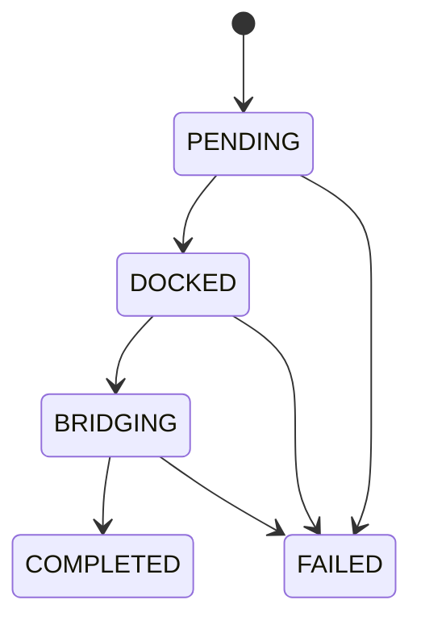

# Aqua0 Contracts

A cross-chain shared liquidity protocol built on 1inch Aqua that enables liquidity providers to deploy trading strategies across multiple blockchains through virtual balance accounting. Funds remain in LP-controlled accounts, never in protocol custody.

**Source of truth:** The **Technical Architecture** section in `Aqua0_PRD.md` is authoritative for contract scope and behavior.

## How It Works

1. **Create an Account** — Deploy an LP account via `AccountFactory.createAccount(signature)` using CreateX CREATE3 for deterministic addresses across chains (salt = keccak256(signature), verified via SignatureChecker)
2. **Deposit tokens** — Transfer tokens into your account
3. **Approve Aqua** — Call `account.approveAqua(token, amount)` so Aqua can pull tokens during swaps
4. **Activate strategies** — Call `account.ship(strategyBytes, tokens, amounts)` to create virtual balance entries in Aqua
5. **Earn fees** — Traders execute swaps against your virtual liquidity via SwapVM; fees accumulate
6. **Rebalance** — The authorized rebalancer moves virtual balances across chains via Stargate/LayerZero:
   - **Dock** the full strategy on the source chain (zeros all virtual balances)
   - **Reship** the remainder on source (re-activate the portion staying on this chain)
   - **Bridge** the rebalance portion to the destination via Stargate + compose message
   - **Ship** on destination via Composer's `lzCompose` → `account.onCrosschainDeposit()`
7. **Deactivate** — Call `account.dock(strategyHash)` to zero virtual balances; tokens remain in your account

## Project Structure

```
src/
├── lp/
│   ├── Account.sol                 # Non-custodial LP account (maker + app in Aqua)
│   └── AccountFactory.sol          # CREATE3 factory for deterministic account addresses
├── aqua/
│   └── AquaAdapter.sol           # Optional wrapper for Aqua ship/dock calls
├── rebalancer/
│   └── Rebalancer.sol            # Cross-chain rebalancing orchestration
├── bridge/
│   ├── StargateAdapter.sol       # Stargate V2 bridge adapter
│   └── Composer.sol         # Destination-side bridge receiver
├── interface/
│   ├── IAqua.sol                 # 1inch Aqua interface (rawBalances, ship, dock)
│   ├── IStargate.sol             # Stargate V2 interface
│   ├── ISwapVMRouter.sol         # SwapVM Router interface
│   ├── ICreateX.sol              # CreateX CREATE3 interface
│   ├── IStargateAdapter.sol       # StargateAdapter interface
│   └── IAccount.sol                # Account cross-chain hook interface
└── lib/
    ├── Errors.sol                # Custom error definitions
    ├── Events.sol                # Event definitions
    └── Types.sol                 # Shared types (RebalanceOperation, ChainConfig)

script/
├── DeployLocal.s.sol             # Foundry deploy script (Base + Unichain)
└── local-deploy.sh               # Shell orchestration (Anvil lifecycle + deploy + fund)
```

## Key Contracts

### Account

Non-custodial LP wallet that holds tokens and acts as "maker" in Aqua's 4D balance mapping: `_balances[maker][app][strategyHash][token]`. Ships under the SwapVM Router's app namespace so the router can find balances during swaps.

**Initialization:** `initialize(owner, factory, aqua, swapVMRouter)` — called once after BeaconProxy deployment. All instances share implementation via UpgradeableBeacon.

**Storage (set once via initialize):** `owner`, `factory`, `aqua`
**Settable state:** `swapVMRouter`, `stargateAdapter`, `composer`

| Function | Access | Description |
|----------|--------|-------------|
| `ship(strategyBytes, tokens[], amounts[])` | Owner | Activate strategy in Aqua |
| `dock(strategyHash)` | Owner / Rebalancer | Deactivate strategy (auto-retrieves stored tokens) |
| `onCrosschainDeposit(strategyBytes, tokens[], amounts[])` | Composer | Ship after cross-chain bridge receipt |
| `approveAqua(token, amount)` | Owner | Approve Aqua to pull tokens |
| `setSwapVMRouter(address)` | Owner | Update SwapVM Router address |
| `setComposer(address)` | Owner | Set bridge receiver for cross-chain deposits |
| `withdraw(token, amount)` | Owner | Withdraw ERC20 tokens |
| `withdrawETH(amount)` | Owner | Withdraw native ETH |
| `authorizeRebalancer(address)` | Owner | Authorize rebalancer for dock operations |
| `revokeRebalancer()` | Owner | Revoke rebalancer authorization |
| `rebalancerBridge(token, dstEid, amount, ...)` | Owner / Rebalancer | Bridge tokens via StargateAdapter |
| `setStargateAdapter(address)` | Owner | Set StargateAdapter for bridging |
| `getRawBalance(strategyHash, token)` | View | Query `(uint248 balance, uint8 tokensCount)` from Aqua |
| `getStrategyTokens(strategyHash)` | View | Get tokens stored at ship-time |

### AccountFactory

Deploys accounts with CreateX CREATE3 for deterministic addresses across chains. Inherits `Ownable`. Deploys BeaconProxy instances pointing to UpgradeableBeacon. CREATE3 addresses depend only on deployer + salt (not bytecode or constructor args), so the same owner + salt produces the same account address on any chain regardless of protocol addresses.

**Constructor:** `constructor(address _aqua, address _swapVMRouter, address _createX, address _accountImpl)`

**Immutables:** `AQUA`, `SWAP_VM_ROUTER`, `CREATEX`

| Function | Description |
|----------|-------------|
| `createAccount(signature)` | Deploy new account (owner = signer, salt = keccak256(signature)) |
| `getAccount(owner, salt)` | Look up existing account |
| `isAccount(address)` | Check if address is a deployed account |
| `upgradeAccountImplementation(newImpl)` | Upgrade beacon implementation (onlyOwner) |

### Rebalancer

Orchestrates the cross-chain rebalancing state machine. Deployed behind ERC1967Proxy (UUPS pattern). `initialize(owner, rebalancer)` called once after proxy deployment.



| Function | Description |
|----------|-------------|
| `triggerRebalance(lpAccount, srcChainId, dstChainId, token, amount)` | Start operation (→ PENDING) |
| `executeDock(operationId, strategyHash)` | Dock source strategy (→ DOCKED) |
| `executeBridge(operationId, ...)` | Bridge tokens via Account.rebalancerBridge() |
| `recordBridging(operationId, messageGuid)` | Record bridge initiation (→ BRIDGING) |
| `confirmRebalance(operationId)` | Confirm completion (→ COMPLETED) |
| `failRebalance(operationId, reason)` | Mark failure (→ FAILED) |

**Dock-Reship-Bridge Pattern:** In practice, rebalancing a partial amount requires: (1) dock the full strategy on source (Aqua requires full dock), (2) reship the remainder on source to keep that portion active, (3) bridge only the rebalance amount to the destination, where Composer calls `onCrosschainDeposit()` to ship into Aqua. This ensures both chains end up with the correct virtual balances.

### Bridge Components

**StargateAdapter** — Token bridging via Stargate V2 with optional compose messages for destination-side execution. The Stargate pool address is admin-settable via `setStargate()` to support pool migrations without redeployment.

**Composer** — Destination-side bridge receiver. Receives tokens from Stargate, forwards them to the target account, and calls `onCrosschainDeposit()` so the account can ship into Aqua on the destination chain. Token, LZ endpoint, and Stargate addresses are admin-settable via `setToken()`, `setLzEndpoint()`, and `setStargate()`.

| Function | Contract | Description |
|----------|----------|-------------|
| `setStargate(address)` | StargateAdapter | Update Stargate pool address (onlyOwner) |
| `setToken(address)` | Composer | Update bridged token address (onlyOwner) |
| `setLzEndpoint(address)` | Composer | Update LZ endpoint address (onlyOwner) |
| `setStargate(address)` | Composer | Update Stargate pool address (onlyOwner) |

## Aqua Integration

The IAqua interface matches the real [1inch Aqua protocol](https://github.com/1inch/aqua):

```solidity
interface IAqua {
    function ship(address app, bytes memory strategy, address[] memory tokens, uint256[] memory amounts)
        external returns (bytes32 strategyHash);
    function dock(address app, bytes32 strategyHash, address[] memory tokens) external;
    function rawBalances(address maker, address app, bytes32 strategyHash, address token)
        external view returns (uint248 balance, uint8 tokensCount);
    function safeBalances(address maker, address app, bytes32 strategyHash, address token0, address token1)
        external view returns (uint256 balance0, uint256 balance1);
}
```

Key semantics:
- **maker** = `msg.sender` when calling `ship()` (the Account address)
- **app** = first parameter to `ship()` — the Account passes `swapVMRouter` so the SwapVM Router can find balances during swaps
- **strategyHash** = `keccak256(strategy)` — computed by Aqua from raw strategy bytes
- **`tokensCount = 0xff`** in `rawBalances()` means the strategy is docked
- **`dock()` requires tokens[]** — Account stores tokens at ship-time and retrieves them automatically

## Testing

### Prerequisites

- [Foundry](https://book.getfoundry.sh/getting-started/installation) (forge, cast, anvil)

### Quick Start

```bash
# Install dependencies
forge install

# Build
forge build

# Run all unit tests
FOUNDRY_OFFLINE=true forge test -vvv

# Run fork tests (requires RPC URLs)
BASE_RPC_URL=<url> UNICHAIN_RPC_URL=<url> forge test --match-path test/CrosschainFork.t.sol -vvv
```

### Local Development

Fork Base or Unichain mainnet locally with Anvil, deploy all contracts, and set up a ready-to-use environment for LP and swapper testing. External contracts (Aqua, SwapVM Router, Stargate, LZ Endpoint, WETH, USDC) come for free from the fork.

```bash
# Base fork (default) — deploy, fund, keep Anvil alive
bun run local

# Unichain fork
bun run local:unichain

# Deploy only (Anvil exits after)
bun run local:deploy

# Kill Anvil
bun run local:down

# All addresses + strategy hashes
cat deployments/localhost.json
```

**What gets set up:**

| Account | Role | Tokens | Notes |
|---------|------|--------|-------|
| Anvil #0 (`deployer`) | LP | 10 WETH + 100k USDC in account | WETH & USDC approved for Aqua |
| Anvil #1 (`swapper`) | Trader | 10 WETH + 100k USDC | Approved for SwapVM Router + Aqua |

A WETH strategy (5 ETH) is pre-shipped to Aqua so swappers can immediately call `SwapVMRouter.swap()` against it. The strategy hash is in `deployments/localhost.json` as `wethStrategyHash`.

Env vars: `BASE_RPC_URL`, `UNICHAIN_RPC_URL`, `ANVIL_PORT`.

### Test Suite

| Suite | File | Description |
|-------|------|-------------|
| Account | `LPAccount.t.sol` | Unit tests: ship, dock, withdraw, access control, events, fuzz |
| AccountFactory | `LPSmartAccountFactory.t.sol` | CREATE3, determinism, events |
| Rebalancer | `Rebalancer.t.sol` | State machine, access control, terminal states, events |
| RebalancerIntegration | `RebalancerIntegration.t.sol` | Full flows, dock-reship-bridge pattern, concurrent ops |
| AquaAdapter | `AquaAdapter.t.sol` | Ship, dock, balance queries, fuzz |
| Bridge | `BridgeAdapters.t.sol` | StargateAdapter + Composer + admin setter tests |
| ComposerLzCompose | `ComposerLzCompose.t.sol` | lzCompose edge cases, fuzz, multi-token payloads |
| ComposerDelivery | `ComposerDelivery.t.sol` | End-to-end bridge delivery, replay protection, fuzz |
| StrategyBuilderCrossVerify | `StrategyBuilderCrossVerify.t.sol` | Cross-verify strategy encoding with TypeScript builder |
| Crosschain | `AccountCrosschain.t.sol` | onCrosschainDeposit hook |
| Fork | `CrosschainFork.t.sol` | Real Aqua/SwapVM/Stargate on Base + Unichain forks |
| AMM Strategy Fork | `AMMStrategyFork.t.sol` | Constant Product + StableSwap templates on Base fork |

Fork tests skip gracefully when RPC URLs are not set. They exercise the full LP lifecycle against real deployed contracts: account creation, shipping SwapVM orders, docking, quoting swaps, cross-chain deposits, full rebalance flows, and Stargate compose message delivery.

## Security

- **Non-custodial**: Funds remain in LP accounts; protocol never has custody
- **Access control**: Owner-only for withdrawals and approvals; authorized rebalancer for dock operations
- **Reentrancy protection**: `ReentrancyGuard` on all state-changing functions
- **Custom errors**: All validation uses custom errors (no string reverts)
- **CEI pattern**: Checks-Effects-Interactions enforced throughout
- **Slippage protection**: Bridge operations use `minAmountOut`
- **Cross-chain replay protection**: LayerZero message GUIDs tracked per rebalance operation

## Deployed Addresses

| Contract | Address | Chains |
|----------|---------|--------|
| 1inch Aqua | `0x499943E74FB0cE105688beeE8Ef2ABec5D936d31` | Base, Unichain |
| SwapVM Router | `0x8fDD04Dbf6111437B44bbca99C28882434e0958f` | Base, Unichain |
| CreateX | `0xba5Ed099633D3B313e4D5F7bdc1305d3c28ba5Ed` | 150+ chains |
| Stargate ETH Pool | `0xdc181Bd607330aeeBEF6ea62e03e5e1Fb4B6F7C7` | Base |
| Stargate ETH Pool | `0xe9aBA835f813ca05E50A6C0ce65D0D74390F7dE7` | Unichain |
| LayerZero EndpointV2 | `0x1a44076050125825900e736c501f859c50fE728c` | All EVM chains |
| WETH | `0x4200000000000000000000000000000000000006` | Base, Unichain |
| USDC | `0x833589fCD6eDb6E08f4c7C32D4f71b54bdA02913` | Base |
| USDC | `0x078D782b760474a361dDA0AF3839290b0EF57AD6` | Unichain |

## License

MIT
